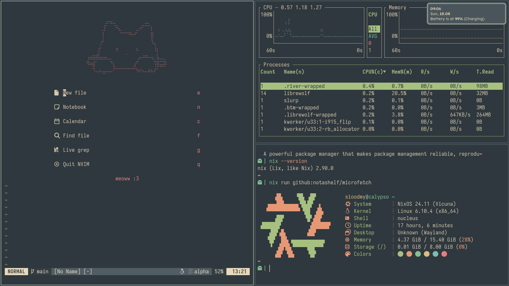

<h1 align="center">
      
       
  
  sioodmy's dotfiles  
    
  

  

   

   
   
   
   
      
    

</h1>

 

## 💛 Donate

If you would like to support me you can sponsor me via ko-fi

... or if you prefer crypto

Ethereum/EVM compatible: `0x2fa1e5e90c011d08bba1f6dbdc317fd293311c0d`

## ❤️ Special thanks tto (I love you guys)

[notusknot](https://github.com/notusknot) -
[siduck](https://github.com/siduck) -
[rxyhn](https://github.com/rxyhn) -
[fufexan](https://github.com/fufexan) -
[hlissner](https://github.com/hlissner) -
[owl4ce](https://github.com/owl4ce) -
[luca.py](https://gitlab.com/luca.py/) -
[FromSyntax](https://github.com/FromSyntax) -
[pupbrained](https://github.com/pupbrained) -
[ini](https://github.com/InioX) -
[ozwaldorf.eth](https://ossian.dev/) - [NotAShelf](https://github.com/NotAShelf)
