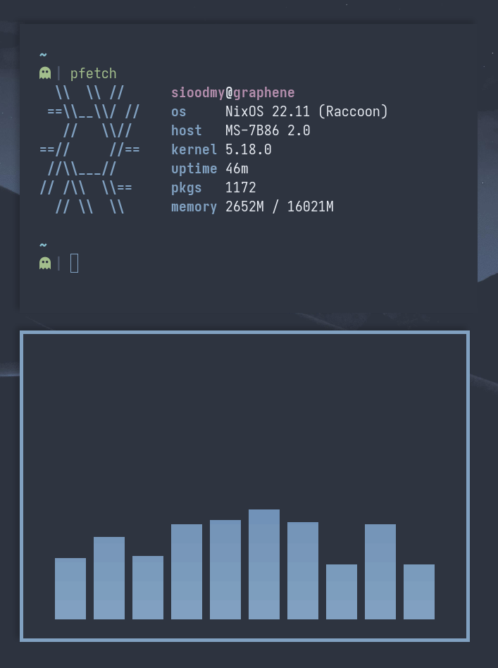

<p align="center">
   <br>
  
</p>

<div align="center">

```ocaml
SIOODMY'S NIXOS CONFIGURATION
```
</div>


<a href="#octocat--hi-there-thanks-for-dropping-by">
  
</a>

<pre>

# Hi there!
   Welcome to me NixOS configuration. 
   Feel free to steal anything from here but don't
   forget to give me credits.
   Remember that this configuration is made
   specifically for my hardware and
   it may not work for yours!
</pre>
<pre>
# Installation
   1) fork this repo
   2) customize configs to your likings
   3) run nixos-rebuild switch --flake .# in your forked repo
</pre>
<pre>
# How do I install it on Arch Loonix?
   That' the neat part, you don't!
   
   
   
   
   
</pre>

<div align="center">

```ocaml
GALLERY
```
</div>


  
