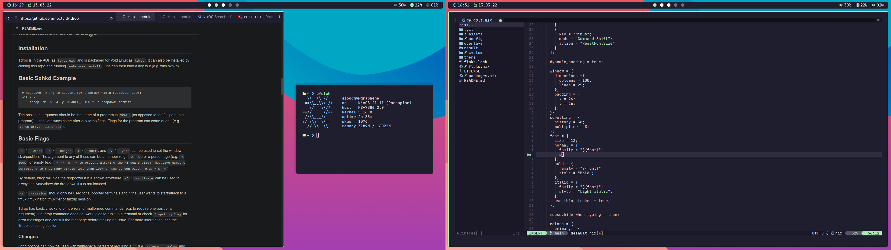

# ❄️ NixOS configuration

This is my NixOS configuration, which I use as my daily driver. It aims to be fast and lightweight without any weirdo-cockless type compromises (like no scrolling in terminal bruh)

> ⚠️ Note that since this configuration is designed just for me and my hardware, you may need to change some things to make it work on your device
> If you really want to use it on your machine, I recomend forking this repo.

# Installation 

## ❄️ Already running NixOS system

``` 
$ nix-shell -p git nixFlakes
$nixos-rebuild switch --flake github:sioodmy/nixdots
```
## 🧹 Clean
1. [Download](https://nixos.org/download.html#download-nix) NixOS ISO
2. [Partition, format and mount your drive](https://nixos.org/manual/nixos/stable/index.html#sec-installation-partitioning)

``` 
$ nix-shell -p git nixFlakes
$ nixos-install --flake github:sioodmy/nixdots
```

## 💡 Tip
```
building the system configuration...
error: flake 'github:sioodmy/nixdots' does not provide attribute 'packages.x86_64-linux.nixosConfigurations."nixos".config.system.build.toplevel', 'legacyPackages.x86_64-linux.nixosConfigurations."nixos".config.system.build.toplevel' or 'nixosConfigurations."nixos".config.system.build.toplevel'
```

Aformentioned error means that you need to specify your hostname

```
# For example:

$ nixos-install --flake github:sioodmy/nixdots#graphene
$nixos-rebuild switch --flake github:sioodmy/nixdots#graphene
```

# Usage 

  
| Key | Action |
|---|---|
| <kbd>Super</kbd> + <kbd>Enter</kbd> | Open terminal |
| <kbd>Alt</kbd> + <kbd>Grave</kbd> | Dropdown terminal |
| <kbd>Super</kbd> + <kbd>Space</kbd> | Application luncher |
| <kbd>Alt</kbd> + <kbd>Tab</kbd> | Window switcher |
| <kbd>Super</kbd> + <kbd>E</kbd> | File manager |
| <kbd>Super</kbd> + <kbd>C</kbd> | Quick calculator |
| <kbd>Super</kbd> + <kbd>period</kbd> | Emoji picker |
| <kbd>Prtscr</kbd> | Screenshot tool |
| <kbd>Super</kbd> + <kbd>Shift</kbd> + <kbd>P</kbd> | Lock screen |
| <kbd>Super</kbd> + <kbd>Volume up</kbd> | Increase mpd volume |
| <kbd>Super</kbd> + <kbd>Volume down</kbd> | Decrease mpd volume |
| <kbd>Super</kbd> + <kbd>Alt</kbd> + <kbd>R</kbd> | Restart bspwm |
| <kbd>Alt</kbd> + <kbd>Control</kbd> + <kbd>Shift</kbd> + <kbd>H, J, K, L</kbd> | Resize focused window |
| <kbd>Super</kbd> + <kbd>W</kbd> | Close focused window |
| <kbd>Super</kbd> + <kbd>Shift</kbd> + <kbd>W</kbd> | Kill focused window |
| <kbd>Super</kbd> + <kbd>M</kbd> | Alternate between the tiled and monocle layout |
| <kbd>Super</kbd> + <kbd>Y</kbd> | Send the newest marked node to the newest preselected node |
| <kbd>Super</kbd> + <kbd>h</kbd> | Swap the current node and the biggest window |
| <kbd>Super</kbd> + <kbd>T</kbd> | Tiled layout |
| <kbd>Super</kbd> + <kbd>Shift</kbd> + <kbd>T</kbd> | Pseudo-tiled layout | 
| <kbd>Super</kbd> + <kbd>S</kbd> | Floating mode |
| <kbd>Super</kbd> + <kbd>F</kbd> | Fullscreen mode |
| <kbd>Super</kbd> + <kbd>Control</kbd> + <kbd>Y</kbd> | Sticky flag |
| <kbd>Super</kbd> + <kbd>Shift</kbd> + <kbd>H, J, K, L</kbd> | Move window |
| <kbd>Super</kbd> + <kbd>H, J, K, L</kbd> | Focus window |
